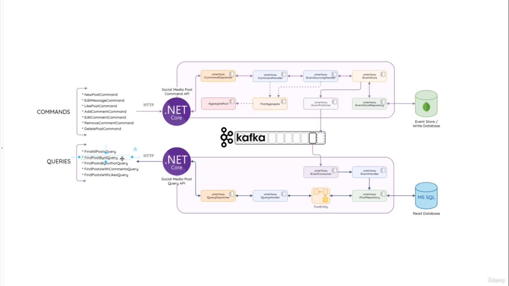

# SocialMediaPlatformApp
This repo is created to learn how to create microservices in C# that are based on CQRS and Event Sourcing. Powered by .NET and Apache Kafka. It is for reference for future projects which consists of features post, comments and likes.

# Technologies
- .Net SDK 6
- Docker
- Apache Kafka

# Tools
- VS Code
- Postman
- Mongo Db
- MS Sql Server

# VS Code Extensions
- https://marketplace.visualstudio.com/items?itemName=ms-dotnettools.csharp

- https://marketplace.visualstudio.com/items?itemName=ms-mssql.mssql

- https://marketplace.visualstudio.com/items?itemName=jmrog.vscode-nuget-package-manager

# Architecture digram
